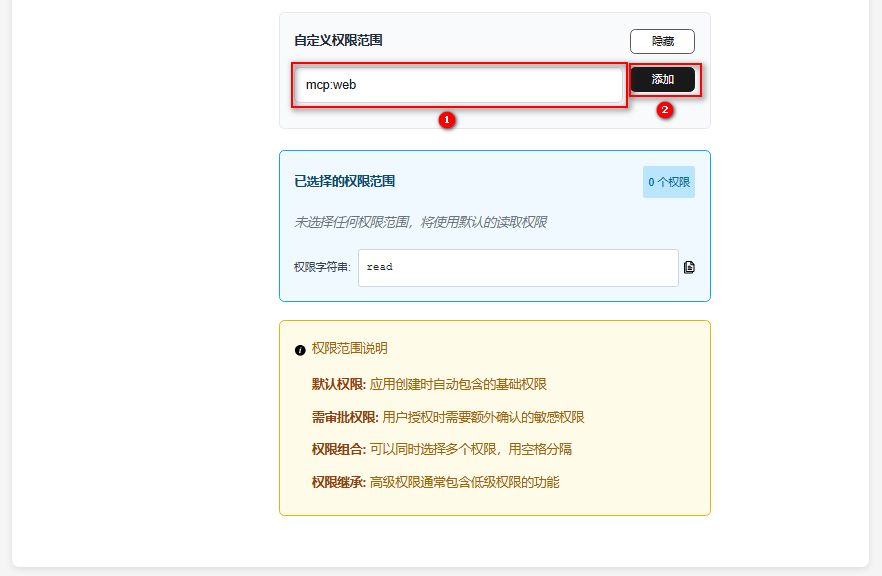

**WebAgent** 是 [OpenTiny](https://opentiny.design/) 推出的统一管理受控端应用和遥控端应用的服务平台，提供智能应用与 AI 的连接通讯、OAuth 鉴权等丰富的特性。
<Info>
我们以 Vue 应用为例，为大家介绍如何使用 NEXT SDK 将现有应用连接到 WebAgent 服务器，转变成智能应用，被 AI 操控。
</Info>

## 在 WebAgent 平台注册应用

**一. 注册并登录**


* 打开： https://agent.opentiny.design/

* 点击去注册，输入账号名、邮箱、密码，完成注册

* 返回来登录界面

* 输入注册的账号密码，完成登录。

**二. 创建应用**

1. 点击顶部菜单项：应用管理，跳转到应用管理页面

2. 点击创建应用，进入创建应用流程


3. 选择桌面应用


4. 输入应用名称，点击下一步


5. 输入三个重定向 URL


解释：

- `http://localhost:8001/auth/callback` 为登录授权之后，重定向的地址，给后端发送 code，需要放在第一个。
- `http://localhost:8089`  该地址为受控制端前端的地址，需要加上，不然会有跨域错误。
- `http://localhost:8088`  该地址为控制端前端的地址，需要加上，不然会有跨域错误。

6. 输入操控端回调 uri (选填)。


`http://localhost:6274/oauth/callback` 表示我们的应用允许被 `http://localhost:6274` 的操控端操控。

7. 输入 scope 为 mcp:web，然后点击下一步。




8. 点击下一步


9. 勾选我已仔细检查上述配置，确认创建此 OAuth 应用


10. 复制 clientId


11. 修改项目中的相关配置, 详情参考 创建 WebMcpClient ，并与 WebAgent 连接

## 安装 NEXT SDK

```shell
npm i @opentiny/next-sdk
```

## 创建 WebMcpClient，并与 WebAgent 连接

在 **App.vue** 文件中加入以下代码：

```typescript
import { onMounted } from 'vue'
import { WebMcpClient,AuthClientProvider, createMessageChannelPairTransport } from '@opentiny/next-sdk'


const getAuthCodeByState = (url: string | URL, state: string) => {
  return fetch(callback, {
    method: 'POST',
    credentials: 'include',
    headers: {
      'Content-Type': 'application/x-www-form-urlencoded',
      Authorization: `Bearer ${token}` // token 为设置的请求头 token
    },
    body: new URLSearchParams({ state })
  });
};

const ECS_METADATA = {
  client_name: 'Console ECS Client',
  redirect_uris: [ECS_CALLBACK], // ECS_CALLBACK 为登录授权之后，重定向的地址
  grant_types: ['authorization_code', 'refresh_token'],
  response_types: ['code'],
  token_endpoint_auth_method: 'client_secret_post',
  scope: 'mcp:web'
};

const authProvider = new AuthClientProvider({ clientMetadata: ECS_METADATA, getAuthCodeByState });

authProvider.saveClientInformation({
  client_id: clientId, // 在 WebAgent 复制的 clientId
  redirect_uris: ECS_METADATA.redirect_uris
});

onMounted(async () => {
  const [serverTransport, clientTransport] = createMessageChannelPairTransport()
  const client = new WebMcpClient()
  await client.connect(clientTransport)
  const { sessionId } = await client.connect({
    agent: true,
    authProvider,
    url: 'https://agent.opentiny.design/mcp',
    sessionId: 'stream06-1921-4f09-af63-51de410e9e09',
  })
)}
```

## 创建 WebMcpServer ，并与 ServerTransport 连接

在 **App.vue** 文件中加入以下代码：

```typescript
import { onMounted } from 'vue'
import { WebMcpServer } from '@opentiny/next-sdk'

onMounted(async () => {
  const server = new WebMcpServer()

  // 注册 MCP 工具
  server.registerTool('demo-tool', {
    title: '演示工具',
    description: '一个简单工具',
    inputSchema: { foo: z.string() },
  }, async (params) => {
    return { content: [{ type: 'text', text: `收到: ${params.foo}` }] }
  })

  await server.connect(serverTransport)
})
```

完成以上步骤，你的 Web 应用就升级为智能应用了，你可以通过各种接入了 AI 的 MCP Host 对智能应用进行操控，具体配置方式参考：[通过各类 MCP Host 操控智能应用](/guide/mcp-host)
