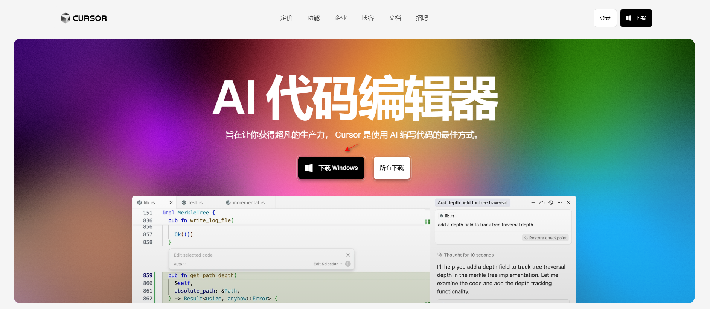
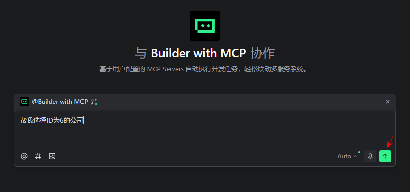
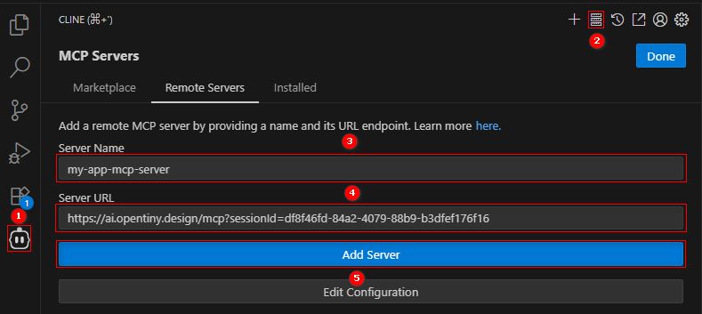

# 通过各类 MCP Host 操控智能应用

当一个传统的 Web 应用通过 NEXT SDK 升级为智能应用之后，该应用就可以被 AI 操控了。

操控 Web 应用的程序我们称为遥控器，它是一个接入了 AI 的对话框程序，遥控器的载体可以是多种多样的，可以是支持 MCP 的 IDE 软件，比如：VSCode Copilot、Cursor 等，可以是通过智能体平台搭建的智能体应用，比如：Dify、Coze 等，也可以是网页 AI 对话框，比如：Ant Design X、Element Plus X 等，甚至可以是一个手机 App 或 小程序。

## VSCode Copilot

a. 在 VSCode 软件中打开你的项目工程，在项目根目录增加 `.vscode` 文件夹，里面添加一个 `mcp.json` 文件，在该文件中加入以下内容：

```json
{
  "servers": {
    "my-app-mcp-server": {
      "url": "https://ai.opentiny.design/mcp?sessionId=stream06-1921-4f09-af63-51de410e9e09"
    }
  }
}
```

b. 配置完成之后点击 `my-app-mcp-server` 上方的启动按钮，这时你的 Web 应用的 MCP Server 就启动了。


c. 然后使用快捷键 Ctrl + Alt + I 打开 VSCode Copilot AI 对话框，切换到 Agent 模式。


d. 在输入框中输入需要操作的内容，这时 AI 就会调用你的 Web 应用中定义的 MCP 工具，操作你的 Web 应用，例如帮我选中ID为6的公司,就会调用定义的mcp工具，点击继续按钮


e. 查看是否调用 MCP 工具成功


## Cursor

a. 在 https://cursor.com/cn 官网下载Cursor软件



b. 在Cursor中配置mcp servers ctrl + L 弹出AI对话框，点击设置按钮进行设置 MCP Server 


c. 按照下面的步骤手动进行手动添加

```json
{
  "servers": {
    "my-app-mcp-server": {
      "url": "https://ai.opentiny.design/mcp?sessionId=stream06-1921-4f09-af63-51de410e9e09"
    }
  }
}
```

d. 查看mcp是否配置成功并且进行验证


e. 新建会话，切换到 Agent 模式，在输入框中输入需要操作的内容，这时 AI 就会调用你的 Web 应用中定义的 MCP 工具，操作你的 Web 应用


## Windsurf

a. 在 https://windsurf.com/ 官网下载 Windsurf 软件


b. 在 Windsurf 中配置 mcp servers ，先找到windsurf对话框上方的锤子按钮 


c. 配置mcp_config.json*文件，格式如图


d. 点击Refresh会出现我们的mcp servers


e. 新建会话，切换到 Agent 模式，在输入框中输入需要操作的内容，这时 AI 就会调用你的 Web 应用中定义的 MCP 工具，操作你的 Web 应用


## Trae

下载软件


在Trae中配置mcp servers

ctrl + u 弹出AI对话框，找到AI功能管理中的AI功能管理按钮


继续按照下面的步骤手动添加 mcp servers


手动配置格式如图


查看mcp是否配置成功并且进行验证



新建会话，选择mcp智能体


验证成功


## Cherry Studio

下载软件


选择助手


在 Cherry Studio配置mcp servers

配置mcp，格式如图


配置模型


注册登录账号，选择一个适合自己的模型，成功后如下图


在对话框中进行验证


## Cline

vscode下载Cline 插件


用github账号进行登录

在cline中配置mcp servers



会自动生成下面的文件


智能体选中agent然后进行验证


验证成功


## 通义灵码

下载 IDE 软件


在通义灵码中配置mcp servers

Ctrl + Shift + L 弹出AI对话框，找到AI功能管理中的AI功能管理按钮


继续按照下面的步骤手动添加 mcp servers


手动配置格式如图


查看mcp是否配置成功并且进行验证


新建会话，选择智能体


验证成功


## Dify

进入dify官网，登录后点击打开网页版并进行登录注册


在 Dify 中配置mcp servers

创建Chatflow空白应用


新建agent智能体


设置 AGENT 策略


设置模型


MCP 服务配置


查看运行是否成功


进行发布


运行这个编排任务


验证这个任务


验证成功


## Coze

进入 coze 官网，登录后点击打开网页版


在 coze 中配置mcp servers

添加管理工具


添加自定义管理工具


查看是否添加成功（如下图）


进行验证


